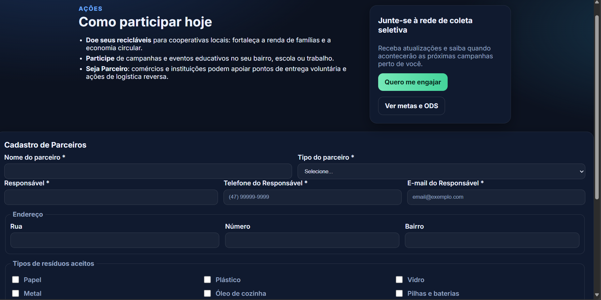
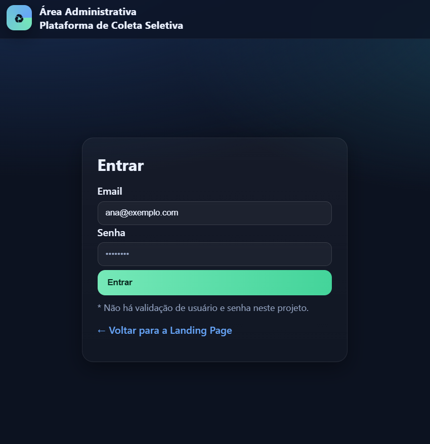
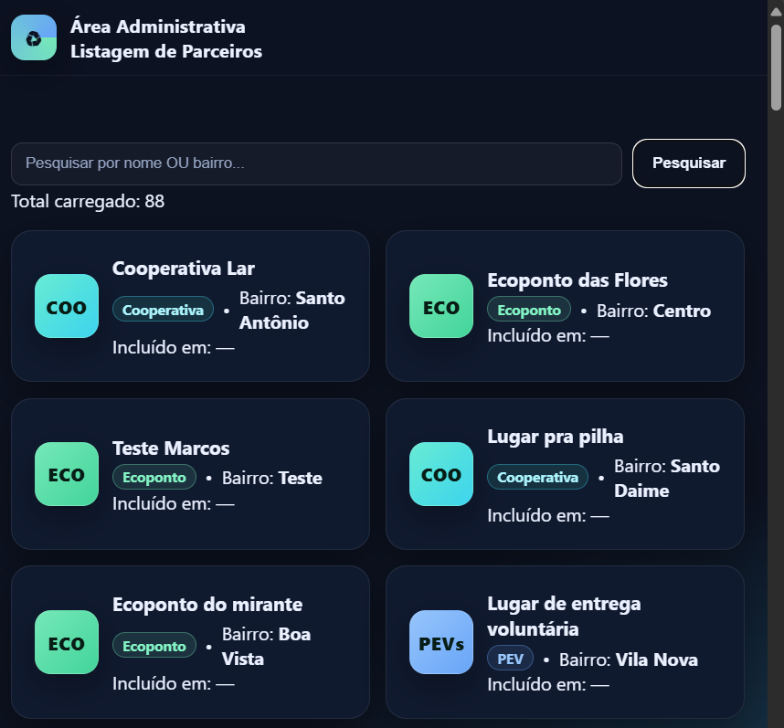

# Landing Page → Cadastro de Parceiros → Login → Listagem de Parceiros

---

# Plataforma Cidadã — Coleta Seletiva (Landing Page)

Landing page do mini-projeto **\[M02S07]** para divulgação das ações de coleta seletiva em Joinville, alinhada aos **ODS 11** (Cidades e Comunidades Sustentáveis) e **ODS 12** (Consumo e Produção Responsáveis).

> Objetivo é apresentar o projeto, explicar impacto, engajar a população e indicar ações práticas de participação.

---

## ✨ Funcionalidades

* **Seções**: Início (hero), Objetivos, Impacto, Ações.
* **Cabeçalho fixo** com logo/título e **menu âncora** para as seções.
* **Menu mobile** (abre/fecha e rola suavemente).
* **Design moderno** com paleta escura, cartões e CTA.
* **Responsivo** (desktop/tablet/mobile).
* **Rodapé** com integrantes, link para os ODS e logos (Prefeitura, Lab365, SENAI).
* **Padrão de ícones** com tamanho e estilo uniforme.

---

## 🧭 ODS Envolvidos

* **ODS 11 — Cidades e Comunidades Sustentáveis**
* **ODS 12 — Consumo e Produção Responsáveis**

Saiba mais: [https://www.un.org/sustainabledevelopment/pt/](https://www.un.org/sustainabledevelopment/pt/)

---

## 🗂️ Estrutura do Projeto

```
.
├─ index.html
├─ css/
│  └─ style.css
├─ js/
│  └─ main.js
└─ assets/
   ├─ logo.png|svg
   ├─ prefeitura.png|svg
   ├─ lab365.png|svg
   └─ senai.png|svg
```

* `index.html`: marcação da landing page.
* `css/style.css`: tema, layout, responsividade e componentes.
* `js/main.js`: navegação mobile (toggle do menu).
* `assets/`: logos e imagens do projeto.

---

## 🚀 Como executar

### Opção A) Abrir direto

Dê duplo clique em `index.html` e navegue no seu browser.

### Opção B) Servidor local (recomendado)

No terminal, dentro da pasta do projeto:

**Com Python 3:**

```bash
python -m http.server 8080
# abra http://localhost:8080
```

**Com VS Code (Live Server):**

1. Abra a pasta no VS Code.
2. Instale a extensão “Live Server”.
3. Clique em “Go Live” no rodapé.

---

## 🔧 Criação rápida da estrutura (bash)

Se ainda não criou as pastas/arquivos:

```bash
mkdir -p css js assets
touch index.html css/style.css js/main.js
# coloque seus logos em /assets (png ou svg)
```

---

## 🎨 Estilo & Componentes

* **Tema escuro** com variáveis CSS (cores e sombras centralizadas).
* **Hero** com título/subtítulo e CTA.
* **Cards** para Objetivos/Impacto/Ações.
* **Ícones/Logos padronizados** (tamanho e aparência consistentes).

  * Se usar PNGs variados, o CSS já força tamanho uniforme.
  * Prefira imagens com pouco espaço em branco interno.

---

## 📱 Responsividade

* Grid fluido com breakpoints em `960px`.
* Menu desktop alterna para **menu mobile** (overlay) em telas menores.
* Tipografia e espaçamentos adaptáveis (`clamp()`).

---

## ✅ Checklist de Entrega

* [ ] **Início** com título, subtítulo e imagem/ilustração.
* [ ] **Objetivos**: descrição e menção aos **ODS 11 e 12**.
* [ ] **Impacto**: tópicos (ciclo da reciclagem, ação individual, custos da má gestão).
* [ ] **Ações**: doar recicláveis, participar de campanhas/eventos, ser parceiro.
* [ ] **Cabeçalho** com logo, título e **menu** (Início, Objetivos, Impacto, Ações) apontando para as seções.
* [ ] **Footer** com **participantes do grupo**, link para os ODS e logos da **Prefeitura**, **Lab365** e **SENAI**.
* [ ] **Responsividade** implementada e testada.
* [ ] **Menu mobile** funcionando (abre/fecha e faz scroll suave).
* [ ] **Ícones padronizados** no estilo do projeto.

---

## 👥 Squad

Preencha com os integrantes:

* Nome 1
* Nome 2
* Nome 3
* Nome 4
* Nome 5

---

## 🛠️ Tecnologias & Boas Práticas

* **HTML5**, **CSS3**, **JavaScript (Vanilla)**.
* Sem dependências externas obrigatórias.
* Nomenclatura e CSS organizados por seções.
* Acessibilidade básica: contrastes, foco em links/menus, labels nos botões.

---

## 📌 Próximos passos (sugestões)

* Inserir dados reais de pontos de coleta (mapa).
* Área de notícias/eventos.
* Formulário de contato/engajamento (newsletter).
* Modo claro/escuro com persistência.
* Deploy em GitHub Pages / Vercel / Netlify.

---

## 📄 Licença

Defina de acordo com as diretrizes do curso (ex.: MIT) ou mantenha “All Rights Reserved”.

---

## Resultado






